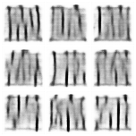
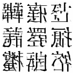
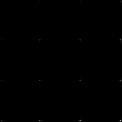
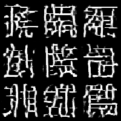
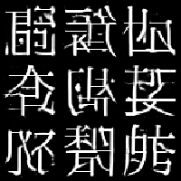
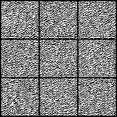

# Real Looking Fake Kanji  
### Exploring AI Models for Kanji Generation  

---

**Author:** Chandon Hamel 

**Organization:** Anderson College of Business and Computing, Regis University

**Date:** March 9, 2025

**Repository:** [GitHub](https://github.com/feebami/GANji)

---
## Introduction
This project combines two of my main interests: deep learning and the Japanese language. As a learner of Japanese, it took me a long time to fully appreciate Kanji characters and the vital role they play in the language as a whole. To me, and many others before studying and learning how to read them, Kanji looked like a collection of jumbled lines and shapes. However, there is a hidden structure and logic to them that reveal their meaning and utility. I believe this made Kanji a particularly interesting and challenging task for training generative AI models. Because I have learned a fair number of Kanji, it is easy for me to visually evaluate how well the models were able to mimic these characters.

Generative AI models like DALL·E, MidJourney, and others have revolutionized the field of AI image generation, making it possible to create stunning visual outputs from text prompts. Curious about how these models work, I decided to explore these techniques myself and learn how to apply them to create something both visually compelling and technical, fake Kanji generation. Once I found a suitable dataset of Kanji images to practice training these generative models, I knew this would be a project I would enjoy.

After reading *Hands-On Machine Learning with Scikit-Learn, Keras & TensorFlow*  by Aurelien Geron, I was introduced to three key generative modeling techniques: Variational Autoencoders (VAEs), Generative Adversarial Networks (GANs), and Denoising Diffusion Probabilistic Models (DDPMs). This inspired me to focus the project on evaluating and comparing the performance of these techniques in generating realistic Kanji characters.

## Table of Contents
- [Datasets and Preprocessing](#datasets-and-preprocessing)
- [Model Creation](#model-creation)
    - [VAE](#variational-autoencoder-vae)
    - [GAN](#generative-adversarial-network-gan)
    - [DDPM](#denoising-diffusion-probabilistic-model-ddpm)
- [Comparative Analysis](#comparative-analysis)
- [Challenges and Lessons Learned](#challenges-and-lessons-learned)
- [Applications and Future Work](#applications-and-future-work)
- [Conclusion](#conclusion)
- [Credits](#credits)

## Datasets and Preprocessing
Three datasets were used in this project: the main [Kanji Dataset](https://www.kaggle.com/datasets/frammie/kanjieast-asian-characters) retrieved from Kaggle, as well as MNIST and CIFAR-10. The Kanji Dataset served as the primary dataset for training all three generative models, as it contained approximately 10,000 black-and-white images of Kanji characters in a standardized font. These images were well-suited for evaluation due to their consistent structure and relatively small resolution, making them manageable for training on personal hardware.

MNIST and CIFAR-10 datasets were used exclusively with the GAN as secondary datasets for testing purposes. These datasets helped validate the GAN implementation when initial attempts at generating Kanji produced poor results due to my own implementation mistakes. Since MNIST (handwritten digits) and CIFAR-10 (low-resolution color images of objects) are commonly used in generative modeling and are more easily solvable, they provided a more reliable baseline for debugging and ensuring the GAN was working correctly. Once the GAN produced satisfactory results with these datasets, I returned to the Kanji Dataset for further experimentation.

### Kanji Dataset Preprocessing
To prepare the data for training, the Kanji images were preprocessed using a custom PyTorch Dataset class. This applied a composite transformation to the data to prepare it for input into the models. First, all Kanji images were resized to 64x64 pixels to ensure uniform input size across the models and accommodate deeper pooling layers in the neural networks. Next, pixel values were normalized to meet the requirements of each model:
- For the VAE, pixel values were scaled to the range [0, 1].
- For the GAN and DDPM, pixel values were normalized to the range [-1, 1].

A random horizontal flip was applied to the Kanji images as a data augmentation technique. While Kanji characters are generally asymmetrical, the augmentation effectively doubled the training dataset size and introduced variation that improved the models' generalization. This trade-off between introducing distortion and increasing data diversity was deemed worthwhile.

See the **KanjiDataset** class in [VAE/main.py](https://github.com/Feebami/GANji/blob/main/VAE/main.py) as well as the transform variable. 

### CIFAR-10 and MNIST Preprocessing
When using CIFAR-10 and MNIST datasets for GAN testing, a similar preprocessing approach was applied. CIFAR-10 images, being natural color images, were normalized with three channels ([R, G, B]) to the range [-1, 1], while MNIST grayscale images used a single channel. Both datasets were resized to 64x64 pixels to match the input size expected by the GAN architecture. These preprocessing steps ensured compatibility between the datasets and the implemented GAN, enabling seamless transitions between debugging and Kanji experiments.

### Data Loading
The preprocessed images were loaded using a PyTorch DataLoader, which enabled batch processing and efficient feeding of data to the models. For the Kanji Dataset, a custom Dataset class was used to load the images from disk, perform transformations, and apply horizontal flips dynamically during training. For CIFAR-10 and MNIST, the respective PyTorch datasets provided built-in functionality to handle download and loading. The DataLoader was configured with multi-threaded workers (num_workers=4), memory pinning (pin_memory=True), and prefetching (prefetch_factor=2) to optimize the throughput of data pipelines, minimizing I/O bottlenecks during training.

See the **dataloader** variable in [VAE/main.py](https://github.com/Feebami/GANji/blob/main/VAE/main.py).

### Sample Kanji Data

## Model Creation
As mentioned previously, three techniques were used in this generative AI exploration. I started with the most straightforward approach and moved to more complex techniques once satisfactory results were achieved. This progression allowed for early successes but quickly transitioned into periods of exasperation as the complexity increased.

The first model I attempted, the Variational Autoencoder (VAE), produced decent results almost immediately, within about three hours of starting the project. Its relatively simple architecture and objective made it an excellent starting point for the exploration.

The Generative Adversarial Network (GAN), on the other hand, was much more finicky. I spent many hours over several days troubleshooting why it wouldn't produce good results, even on the simpler test datasets like MNIST and CIFAR-10. Eventually, I found the issue with my configuration and made the necessary adjustments. While the process was frustrating, it taught me valuable lessons about GAN instability, debugging complex models, and the importance of iterative introduction of complexity. 

Finally, I implemented the Denoising Diffusion Probabilistic Model (DDPM). While the results it produces are promising, I am not yet completely satisfied with my implementation and believe there is significant room for improvement. There are certainly improvements I can make to all of my models, but the DDPM currently feels furthest from satisfactory. As of writing this, the DDPM results are encouraging, and I look forward to further exploring and refining this technique in the future.

### Variational AutoEncoder (VAE)
#### Overview
The Variational AutoEncoder (VAE) is a generative model that combines elements of probability and deep learning to create structured outputs. It is composed of two main components: an encoder, which compresses input data into a continuous latent space, and a decoder, which reconstructs the original input based on sampled points from this latent space. Unlike traditional (non-variational) autoencoders, VAEs incorporate a probabilistic latent representation. Specifically, the encoder outputs parameters, typically the mean (mu) and log-variance (logvar), that define a Gaussian distribution, allowing the decoder to sample diverse yet meaningful variations.

VAEs were an ideal starting point for this project because of their simplicity and well-defined architecture. Unlike other generative techniques, VAEs are straightforward to implement and train, requiring only a combination of reconstruction loss (e.g., binary cross-entropy) and regularization via the Kullback-Leibler (KL) divergence in the latent space. These properties also make VAEs relatively stable during training, even with limited computational resources. The early success obtained from implementing a VAE built confidence and set the foundation for exploring more complex generative models later in the project.

#### Architecture
Two main design patterns were implemented for the VAE architecture: one without residual connections and one with a ResNet-like design. The simpler architecture without residual connections served as a good starting point, but it quickly became evident that a ResNet-like architecture performed significantly better. The ResNet-inspired design was chosen based on prior success with similar architectures for classification tasks and because of its ease of implementation. Additionally, the encoder-decoder nature of the VAE naturally benefits from a symmetrical structure centered around the latent space which was straightforward to implement using this design paradigm.

Both the encoder and decoder were composed of seven residual blocks. The encoder blocks progressively reduced the spatial dimensions of the input, with convolutional channels increasing from 64 to 512, while the decoder symmetrically reversed this process with convolutional channels decreasing from 512 to 64. Each residual block included two convolutional layers with a kernel size of 3x3, batch normalization, and ReLU activations, as well as a shortcut connection to stabilize training and improve gradient flow. Downsampling in the encoder was achieved via strides in the convolutional layers while upsampling in the decoder was implemented using transposed convolutions with similar strides and an output padding of 1 when required.

At the bottleneck, the encoder flattened the output of the final residual block into a 1D vector, which was passed through two fully connected layers to produce the mean (mu) and log-variance (logvar) vectors for the latent space. These vectors defined the Gaussian distribution from which latent variable samples were drawn during training using the reparameterization trick. The latent dimension was set to 256 for this project, which was found to work well. 

The decoder mirrored the encoder architecture, with its input being the flattened latent vector transformed back into a 3D tensor using a fully connected layer followed by an unflattening operation. The decoder's residual blocks progressively upsampled the spatial dimensions while reducing the number of channels symmetrically. A final series of convolutional layers processed the decoded output to match the original image size, with the final layer producing a single grayscale channel. 

This ResNet-inspired VAE architecture demonstrated stability during training and effectively captured the complex structures of Kanji for generating plausible reconstructions. Its symmetric encoder-decoder design, combined with residual connections, proved crucial for the model's success.

Files for code: 
- [VAE/resnet_vae.py](https://github.com/Feebami/GANji/blob/main/VAE/resnet_vae.py)
- [VAE/variation_autoencoder.py](https://github.com/Feebami/GANji/blob/main/VAE/variational_autoencoder.py)

#### Training process
Training the Variational AutoEncoder (VAE) was implemented using PyTorch Lightning for efficient and modular workflow management. The VAE is trained to minimize a combination of two loss terms: the reconstruction loss and the Kullback-Leibler (KL) divergence. The reconstruction loss, calculated using binary cross-entropy with logits, measures how accurately the decoder reconstructs the input images from their latent representations. The KL divergence regularizes the latent space by encouraging the learned distribution to match a Gaussian prior. The total loss for each batch is the sum of these two terms, ensuring both high-quality reconstructions and a well-structured latent space.

For optimization, the Adam optimizer was used, with learning rate scheduling handled by a OneCycleLR scheduler. This scheduler smoothly adjusts the learning rate over the training process, starting small, increasing to a peak of 1e-3, and then gradually decreasing, which helps stabilize training and improve convergence.

During training, the model logs the total training loss (train_loss) for tracking performance across epochs. The model also generates sample reconstructions from random latent vectors at regular intervals (every "sample_every" epochs). These samples are saved as grids of images, providing visual feedback on the VAE's ability to produce realistic and diverse Kanji-like characters.

The training loop is managed using PyTorch Lightning's Trainer class, which automates key tasks like device management, checkpointing, and logging. A bf16-mixed precision was used to speed up training while reducing memory usage on compatible GPUs.

Files for code:
- [VAE/main.py](https://github.com/Feebami/GANji/blob/main/VAE/main.py)

#### Hurdles and Lessons Learned
As stated previously, this method worked well early on, and there weren't many significant hurdles. The main challenge was ensuring that the Conv2d and ConvTranspose2d layers produced tensors of the correct size, upsampling and downsampling as intended. The equation provided in the [PyTorch documentation](https://pytorch.org/docs/stable/generated/torch.nn.ConvTranspose2d.html) for calculating the height and width of the output tensor proved invaluable in resolving these issues.

Additionally, the blocks created for the encoder and decoder were not only effective for the VAE but also served as a solid foundation for designing the architectures of the GAN and DDPM later in the project. This reusability of components significantly streamlined the implementation of the other models.

#### Results
<table>
  <tr>
    <td align="center"></td>
    <td align="center"></td>
    <td align="center"></td>
  </tr>
  <tr>
    <td align="center"><em>VAE epoch 10</em></td>
    <td align="center"><em>VAE epoch 20</em></td>
    <td align="center"><em>VAE epoch 100</em></td>
  </tr>
</table>

These images were inverted during the sampling process, a post-processing step that was only applied to the VAE samples. When testing the GAN with the CIFAR-10 dataset, I found this inversion to be undesirable, so it was omitted for other models.

After just 10 epochs, the sampled images already begin to resemble Kanji. While they are still quite blurred, the foundational shapes of the characters are evident. By epoch 20, the images show significant improvement, with much clearer structures, though some areas remain blurry and lack fine detail. After 100 epochs, the reconstructions have improved considerably, and the images appear well-formed and structured.

Although the final outputs are not convincing enough to fool someone into believing they are part of the training dataset, the amount of structure the model can reconstruct from the latent space is impressive. 

### Generative Adversarial Network (GAN)
#### Overview
Generative Adversarial Networks (GANs) are a class of generative models that consist of two neural networks, a generator and a discriminator, working in opposition to improve each other's performance. The generator creates synthetic images from random latent vectors, attempting to mimic the real data distribution. The discriminator evaluates images and attempts to distinguish between real and generated (fake) samples. This adversarial training setup encourages the generator to produce increasingly realistic images while the discriminator improves its ability to identify fake samples.

GANs were chosen as the second generative modeling technique for this project due to their ability to create high-quality images after sufficient training. However, their instability during training, sensitivity to hyperparameters, and reliance on balanced updates to the generator and discriminator make them more challenging to work with compared to Variational AutoEncoders (VAEs). Debugging these issues required testing with simpler datasets, such as MNIST and CIFAR-10, before returning to the Kanji dataset for experimentation. Despite these hurdles, GANs proved capable of creating visually compelling and structured Kanji-like images.
#### Architecture
The GAN implementation for this project used both ResNet-inspired and vanilla convolutional architectures for the generator and discriminator. These architectures were configurable using command-line arguments to allow for flexible experimentation. Below is an explanation of the key components:

**Generator Architecture:**

- The generator starts by mapping a latent vector of size 128 (or another configurable size) to a feature map sized to the starting channels and dimensions of the network.

- The feature map is reshaped into a 3D tensor and passed through a series of upsampling blocks.

- In the vanilla convolutional version, the upsampling is achieved using ConvTranspose2d layers with batch normalization and ReLU activations.

- In the ResNet-inspired version, each upsampling block implements a residual connection around ConvTranspose2d layers, combined with batch normalization and ReLU. These residual connections improve gradient flow and stabilize training.

- The generator outputs a single grayscale channel for the Kanji dataset or three RGB channels for datasets like CIFAR-10. A Tanh activation function is applied to scale the output to the range [-1, 1].

**Discriminator Architecture:**

- The discriminator mirrors the generator, processing 64x64 images through a series of downsampling blocks.

- In the vanilla convolutional version, downsampling is performed with Conv2d layers and LeakyReLU activations.

- In the ResNet-inspired version, each downsampling block includes residual connections for improved performance and stability.

- The final layer flattens the output and uses a fully connected layer to produce a single scalar value, representing the discriminator's prediction that the input image is real.

The ResNet-inspired versions generally yielded better results, offering improved stability and a stronger capability to capture complex features within the data. All Conv2d and ConvTranspose2d layers utilized a kernel size of 3x3. Additionally, BatchNorm2d was intentionally excluded from the discriminator to ensure its predictions remained independent of batch-level statistics.

Files for code:
- [GAN/resgan.py](https://github.com/Feebami/GANji/blob/main/GAN/resgan.py)
- [GAN/gan.py](https://github.com/Feebami/GANji/blob/main/GAN/gan.py)

#### Training Process
The GAN was trained in an adversarial manner, alternating between updates to the generator and the discriminator.

**Training the Discriminator:**

- Loss functions such as hinge loss, Wasserstein loss, or binary cross-entropy (BCE) were used, as specified by command-line arguments.

- For stability, a gradient penalty was applied when using non-BCE losses.

**Training the Generator:**

- The loss function varied depending on the discriminator's loss. BCE between the discriminator prediction and labels of "real" in the case of BCE loss and the negative mean prediction of the discriminator in the case of Wasserstein and hinge loss. These loss functions motivate the generator to produce images the discriminator would classify as real. The best loss was found to be hinge loss in the experiments.

To enhance the discriminator's ability to teach the generator, the discriminator was trained for multiple iterations per batch compared to the generator. This ratio, tunable via the --disc_ratio argument, was set to a default of 5 iterations per generator update during training.

Optimization was performed using the Adam optimizer with learning rates of 1e-4 and beta parameters (0.0, 0.99) for the generator.

To monitor progress, samples were generated and saved at regular intervals (--sample_every epochs) by passing random latent vectors through the generator. These samples were stored as image grids to visually track improvements in image quality over time. Additionally, the training losses for both the generator (g_loss) and discriminator (d_loss) were logged during training for performance evaluation.

The GAN training was implemented using PyTorch Lightning's Trainer class to automate key tasks such as logging, checkpointing, and hardware management. This modular setup enabled efficient experimentation with different architectures, datasets (Kanji, MNIST, CIFAR-10), and loss functions. Bf16-mixed precision was **not** used.

Files for code:
- [GAN/main.py](https://github.com/Feebami/GANji/blob/main/GAN/main.py)

#### Hurdles and Lessons Learned
When transitioning to the GAN, I attempted to apply lessons from the VAE too quickly, assuming that previously successful techniques would work universally. However, features such as the OneCycleLR learning rate scheduler and bf16-mixed precision proved detrimental to the GAN's performance. These choices prevented the model from converging and led to generated images that did not resemble the training data. Identifying these problems required several days of experimentation, which was further exacerbated by the long training times of the GAN, limiting the number of experiments I could run each day.

The lengthy training times were primarily caused by the additional overhead introduced by training the discriminator multiple times per batch (--disc_ratio) and the computational cost of loss calculations such as hinge loss and Wasserstein loss with gradient penalties. Each epoch took considerable time, making rapid iteration difficult and requiring a more organized approach to debugging.

To improve my workflow, I introduced better experimentation methods, such as starting a [log of experiments](gan_experiment_log.txt). This log allowed me to track the changes I was making more effectively and focus on small, incremental adjustments instead of sweeping modifications. I found that making too many changes at once prevented me from pinpointing the cause of any improvements or regressions. Keeping detailed records and methodically testing single modifications became critical, especially with the long training times involved.

Ultimately, after days of frustration, I identified the culprits inhibiting model performance and found a configuration that worked. Through this process, I learned an important lesson: avoid adding unnecessary features or complexity early on. Gradually ramping up complexity provides a stable baseline and makes debugging much easier. Starting with simpler configurations would have made it far easier to identify the issues with the learning rate scheduler and mixed precision from the outset.

#### Results
<table>
  <tr>
    <td align="center"></td>
    <td align="center"></td>
    <td align="center"></td>
    <td align="center"></td>
  </tr>
  <tr>
    <td align="center"><em>GAN epoch 1</em></td>
    <td align="center"><em>GAN epoch 5</em></td>
    <td align="center"><em>GAN epoch 25</em></td>
    <td align="center"><em>GAN epoch 100</em></td>
  </tr>
</table>

Even after 1 epoch, the model starts to recognize where the majority of the lines in the Kanji are located. However, as training progressed, the discriminator began to overpower the generator, causing the generator to "play it safe" by producing mostly black images. This imbalance persisted for a short period until, by epoch 25, the generator began to recover and produce patterns resembling lines, albeit still far from structured Kanji.

By epoch 100, the images generated by the GAN closely resemble Kanji, with some even appearing realistic enough to be mistaken for input images. The lines are well-formed and structured, and the outputs capture the overall essence of Kanji characters.

I am happy with these results, especially considering how quickly they were achieved after resolving the initial issues with the training configuration. While I did attempt further iterations and adjustments to improve the GAN's performance, the results did not improve significantly beyond this point. I believe I got lucky and struck a good balance between generator and discriminator early on after fixing the issues preventing convergence. 

### Denoising Diffusion Probabilistic Model (DDPM)
#### Overview
The Denoising Diffusion Probabilistic Model (DDPM) is a generative model that progressively transforms random noise into coherent images through an iterative denoising process. During training, Gaussian noise is added to input images according to a randomly sampled timestep and a predefined beta schedule, which controls the amount of noise introduced at each step. The model is trained to predict and remove the noise at each step in this process. When generating new images, the DDPM works in reverse, starting with pure noise and iteratively refining it by predicting and removing noise, step by step, until a coherent image emerges.

This method was chosen as the final model in the project because it was the least familiar to me at the outset. Implementing the DDPM served as the "icing on the cake" to the exploration of generative AI. Even though my understanding of the technique was initially limited, I was able to produce encouraging results, albeit with room for improvement.

#### Architecture
The DDPM implementation utilizes a U-Net-like architecture as the core denoising model, tailored for the iterative reverse diffusion process. The U-Net consists of encoder and decoder paths with skip connections to preserve and share spatial information between layers. Below are the key components of the architecture:

**Input Layer:**

- The input is first processed by a convolutional layer with 64 filters to initialize the feature representation.

**Downsampling Path (Encoder):**

- The encoder consists of three sequential "Block" layers with increasing channels (64 → 128 → 256), each reducing the spatial resolution while increasing feature complexity.

- Each block includes multiple convolutional layers followed by GroupNorm and ReLU activations to stabilize training. 

- A shortcut connection is added to increase gradient flow, and a positional embedding vector (sinusoidal embeddings) is incorporated into the convolutional layers to inject timestep information into the denoising process.

**Bottleneck:**

- The bottleneck layers (three blocks) further increase the channel dimensions to 512, capturing the most abstract features of the input at the smallest resolution.

**Upsampling Path (Decoder):**

- The decoder symmetrically mirrors the encoder, progressively increasing spatial resolution (through bilinear interpolation) while reducing the number of channels from 512 to 64.

- Skip connections between corresponding encoder and decoder layers preserve fine-grained details, improving the quality of generated images by concatenating encoder block outputs to decoder block inputs.

**Output Layer:**

- A final convolutional layer maps the feature representation back to the original image dimension. A Tanh activation ensures output pixel values lie in the range [-1, 1].

This U-Net design makes the model well-suited for predicting and removing noise effectively at each timestep. The sinusoidal embeddings provide temporal information, ensuring the model understands which timestep it is operating on. 

Convolutional layers in the network used a kernel size of 3x3 and a group number of 4 was found to work well with the GroupNorm layers.

File for code:
- [DDPM/unet.py](https://github.com/Feebami/GANji/blob/main/DDPM/unet.py)

#### Training Process
Training the DDPM centers on minimizing the mean squared error (MSE) between the predicted noise and the true Gaussian noise added during the forward diffusion process. This encourages the model to accurately predict and remove noise during the reverse process. Below is a breakdown of the training process:

**Forward Diffusion Process:**

- At each timestep t, Gaussian noise is added to the training image. The amount of noise is controlled by precomputed coefficients (sqrt_alpha_cumprod and sqrt_1m_alpha_cumprod), which are derived from a cosine-based beta scheduling strategy. This schedule ensures smooth transitions in noise levels across timesteps.

**Reverse Denoising Process (Training Step):**

- The model predicts the noise added to the image at each timestep, and the training objective is to minimize the MSE between the predicted noise and the true noise.

- During each training step, a random timestep t is selected for each image in the batch, ensuring the model learns to denoise across all stages of the diffusion process.

**Optimization Details:**

- The Adam optimizer is used with a learning rate of 1e-4.

- Learning rate scheduling is handled by a CosineAnnealingLR scheduler, which gradually reduces the learning rate throughout training to prevent overfitting. This technique was crucial in improving the stability of samples.

**Sampling Process:**

- During sampling, the model starts with random noise and iteratively denoises it by progressively applying the learned reverse diffusion steps. This process enables the generation of coherent and high-quality Kanji-like images.

- The training process saves sample outputs every two epochs offering visual feedback on the model's progress in generating Kanji characters.

**Efficiency Considerations:**

- Bf16-mixed precision is used to reduce memory usage and accelerate computations on GPUs.

Files for code:
- [DDPM/main.py](https://github.com/Feebami/GANji/blob/main/DDPM/main.py)

#### Hurdles and Lessons Learned
Training the DDPM presented several challenges, particularly in achieving stability with the generated images. One recurring issue was the model producing high-quality images during training, only to revert to random noise a few epochs later. After careful experimentation, I determined that the optimizer may have been making overly aggressive parameter updates, which destabilized the training process. Introducing a cosine annealing learning rate scheduler resolved this issue, allowing the model to converge more smoothly and produce stable samples by the end of training.

Additionally, switching from a linear beta schedule to a cosine beta schedule for the diffusion process led to further improvements by providing a more gradual and predictable noise progression across timesteps. This adjustment helped the model better understand and reverse the denoising dynamics, improving the quality of generated images.

Inspired by an example repository I was referencing, I attempted to enhance the model by incorporating triplet attention mechanisms between each block in the U-Net. While implementing this feature was an interesting exercise, it did not result in noticeable improvements to the model's performance. 

Despite the DDPM's larger and deeper architecture compared to the GAN, training was significantly faster, and improvements were easier to iterate. 

#### Results
<table>
  <tr>
    <td align="center"></td>
    <td align="center"></td>
    <td align="center"></td>
    <td align="center"></td>
  </tr>
  <tr>
    <td align="center"><em>DDPM epoch 1</em></td>
    <td align="center"><em>DDPM epoch 5</em></td>
    <td align="center"><em>DDPM epoch 25</em></td>
    <td align="center"><em>DDPM epoch 100</em></td>
  </tr>
</table>

After the first epoch, the model has not yet learned how to remove noise effectively, resulting in outputs that are indistinguishable from random noise. By epoch 5, the model still produces mostly noise, but the outputs begin to show variation depending on the initial random conditions, indicating the model is starting to distinguish different patterns in the latent space.

By epoch 25, Kanji-like shapes start to emerge in some samples, though the results remain inconsistent. Some denoising processes yield promising images with visible structure, while others fail to remove enough noise to produce noteworthy results.

After 100 epochs, the DDPM generates images that are quite promising, though not as polished as those produced by the GAN. The lines in the images are cleaner, and the overall structure of the generated characters often resembles Kanji more closely. However, residual noise remains in some areas, and the denoising process does not always fully clean up the image. Despite this, the results demonstrate the DDPM's potential, and I believe there are further architectural and hyperparameter improvements that could elevate the quality of the outputs significantly.

## Comparative Analysis
Each of the three generative models (VAE, GAN, and DDPM) offers unique strengths and challenges for Kanji generation. While the GAN currently produces the most polished results, the DDPM shows the greatest potential for refinement. The VAE, as the simplest and most stable model, served as an excellent starting point for the exploration but is limited by its inherent architecture and training constraints. Below is a deeper comparison of the three models across various dimensions:

### Output Quality
- VAE:
    - The VAE produces structured but blurry images. The probabilistic latent space encoding introduces some lossiness, which appears as a lack of sharpness in the generated Kanji. While scaling the model (e.g., increasing the latent dimension) might slightly improve detail, the fundamental limitation of lossy reconstruction prevents the VAE from achieving the clean lines seen in the GAN or DDPM.

- GAN:
    - The GAN produces the cleanest and most visually convincing Kanji-like images, with well-defined lines and a strong structural resemblance to the training data. Some generated characters are realistic enough to be mistaken for input images. However, occasional artifacts prevent the generated images from being fully convincing.

- DDPM:
    - The DDPM outputs Kanji-like characters with cleaner lines and better structural fidelity than the GAN, but residual noise remains in some areas. This noise detracts from the overall quality but is likely addressable through additional architectural enhancements or hyperparameter tuning. If the noise could be fully removed, the DDPM has the potential to surpass the GAN in overall image quality due to its better ability to capture fine-grained details.

### Training Stability and Workflow
- VAE:
    - The VAE was by far the easiest to implement and train, with stable loss dynamics and straightforward debugging. It provided immediate results and required minimal tuning, making it a great stepping stone into more complex generative models.

- GAN:
    - The GAN presented significant challenges during training, including instability, sensitivity to hyperparameters, and slow convergence. Debugging required extensive experimentation and the use of simpler datasets (MNIST, CIFAR-10) before returning to Kanji. While the breakthrough in results was rewarding, the long training times (due to discriminator-heavy updates and computationally expensive loss functions) make further iteration less appealing.

- DDPM:
    - Despite its deeper and larger architecture, the DDPM exhibited faster training times and easier iterative debugging compared to the GAN. Stable loss progression and deterministic denoising steps simplified experimentation, allowing incremental improvements like switching to cosine beta schedules and learning rate adjustments. These streamlined workflows make the DDPM a more accessible candidate for tuning and refinement over time.

### Potential for Improvement
- VAE:
    - While the VAE is solid for basic Kanji generation, its design limits its flexibility. Improvements are constrained by the lossy nature of its latent space representation, and scaling the architecture or latent dimension is unlikely to eliminate the inherent blurriness in the generated images.

- GAN:
    - The GAN’s architecture is relatively polished, but further tuning could be explored, such as balancing generator/discriminator updates with an adaptive schedule based on discriminator accuracy and experimenting more with Spectral Normalization in the discriminator architecture.

- DDPM:
    - The DDPM shows the most promise for future work. Removing residual noise would dramatically improve the image quality, and experimenting with attention mechanisms, alternative architectural designs, or other sampling methods could help achieve this goal. Additionally, increasing the number of timesteps during sampling or further optimizing the cosine schedules might lead to more consistent results.

### Summary
The VAE was the easiest to implement and provided a strong foundation for exploring generative AI techniques. While its results were decent, they were limited by the latent space’s lossy reconstruction process. The GAN, while producing the cleanest outputs, required significant effort to troubleshoot and train due to its inherent instability and slow training times. The DDPM, with its faster iteration cycles and promising results, shows the greatest potential for refinement. If its residual noise can be eliminated, the DDPM could achieve results superior to the GAN, combining clean structural fidelity with the robustness of iterative denoising.

## Challenges and Lessons Learned
Throughout this project, each generative model presented unique challenges and opportunities for learning. The VAE offered early success, serving as a stable and straightforward starting point. However, adapting lessons from the VAE to the more complex GAN revealed critical hurdles, such as instability and sensitivity to hyperparameters. The GAN’s reliance on balanced adversarial updates and longer training times significantly slowed experimentation, highlighting the importance of carefully scaling complexity and maintaining detailed logs of changes. This experience emphasized the value of incremental adjustments and systematic debugging, allowing me to pinpoint issues like the impact of learning rate scheduling and mixed precision on GAN performance.

The DDPM introduced a different set of challenges, particularly in stabilizing its outputs. Although the model repeatedly reverted to noise during training, applying a cosine annealing learning rate and beta schedules dramatically improved convergence. Training the DDPM was notably faster and more predictable than the GAN, offering a more iterative workflow. This ease of experimentation provided valuable insights into optimizing architectural components, such as embedding timestep information, while reinforcing the importance of refining features gradually.

Across these models, I learned to prioritize simplicity in early configurations, document experiments meticulously, and adapt methodologies based on the unique demands of each model. These lessons will serve as a foundation for future explorations in generative AI.

## Applications and Future Work
While the Kanji images generated by these models may not have immediate practical applications, the methods and foundational knowledge gained through this project are invaluable for future explorations in AI image generation. The experience of implementing, troubleshooting, and refining three distinct generative techniques has greatly expanded my understanding of advanced machine learning concepts.

Key technical details such as Wasserstein distance, hinge loss, beta schedules, and sinusoidal position embeddings were unfamiliar to me at the start of this project but have now become integral to my repertoire. These tools and techniques are not only useful for improving generative models but also applicable to broader deep-learning tasks, from optimizing architectures to enhancing training stability.

Looking ahead, there are several avenues for extending this work. Refining the DDPM architecture, particularly in eliminating residual noise and improving sample consistency, could elevate its performance further. Incorporating attention mechanisms or experimenting with alternative sampling methods might yield significant improvements. Additionally, applying these techniques to other structured or artistic datasets, such as handwritten text in different languages, abstract art, or faces, could uncover new insights and creative possibilities.

Beyond technical improvements, these models could eventually contribute to applications like artistic creation, data augmentation, or even assisting language learners by generating visually consistent characters for educational materials. As AI image generation techniques continue to evolve, having a strong technical foundation will enable me to tackle more ambitious projects and explore creative applications with greater depth and confidence.

## Conclusion
This project explored three generative modeling techniques (VAEs, GANs, and DDPMs) to synthesize Kanji-like images, offering valuable insights into their strengths, limitations, and workflows. Each model presented unique challenges, from the simplicity and stability of the VAE to the instability and fine-tuning requirements of the GAN, and finally to the iterative refinement and potential of the DDPM. While the generated images may not yet have practical applications, the technical knowledge and experience gained, ranging from architectural design to training stability, form a strong foundation for future generative AI projects.

The results demonstrated the GAN's ability to produce the cleanest Kanji-like images, but the DDPM's structured denoising process shows greater promise with further refinement. As generative AI continues to evolve, these methods, tools, and lessons learned will help tackle more ambitious tasks and push the boundaries of what these models can achieve.

## Credits
### GitHub Repositories
**GAN related repositories:**
[pytorch-spectral-normalization-gan](https://github.com/christiancosgrove/pytorch-spectral-normalization-gan)
[PyTorch-GAN](https://github.com/eriklindernoren/PyTorch-GAN)
**Diffusion related repositories:**
[Diffusion-Models-pytorch](https://github.com/dome272/Diffusion-Models-pytorch/tree/main)
[denoising-diffusion-pytorch](https://github.com/rosinality/denoising-diffusion-pytorch/tree/master)
**Triplet Attention:**
[triplet-attention](https://github.com/landskape-ai/triplet-attention/tree/f07524e45db5eea1357c50316f30ab99a292d2f9)

### Useful Book
Aurelien Geron. 2019. Hands-On Machine Learning with Scikit-Learn, Keras, and TensorFlow: Concepts, Tools, and Techniques to Build Intelligent Systems (2nd. ed.). O'Reilly Media, Inc.

### Useful Papers
**Variational AutoEncoder (VAE):**

Kingma, D. P., & Welling, M. (2014). Auto-Encoding Variational Bayes. International Conference on Learning Representations (ICLR).

**Generative Adversarial Network (GAN):**

Goodfellow, I., Pouget-Abadie, J., Mirza, M., Xu, B., Warde-Farley, D., Ozair, S., Courville, A., & Bengio, Y. (2014). Generative Adversarial Networks. Advances in Neural Information Processing Systems (NeurIPS).

Gulrajani, I., Ahmed, F., Arjovsky, M., Dumoulin, V., & Courville, A. (2017). Improved Training of Wasserstein GANs. Advances in Neural Information Processing Systems (NeurIPS).

**Denoising Diffusion Probabilistic Model (DDPM):**

Ho, J., Jain, A., & Abbeel, P. (2020). Denoising Diffusion Probabilistic Models. Advances in Neural Information Processing Systems (NeurIPS).

Nichol, A. Q., & Dhariwal, P. (2021). Improved Denoising Diffusion Probabilistic Models. International Conference on Machine Learning (ICML).

**U-Net Architecture (used in DDPM):**

Ronneberger, O., Fischer, P., & Brox, T. (2015). U-Net: Convolutional Networks for Biomedical Image Segmentation. Medical Image Computing and Computer-Assisted Intervention (MICCAI).

**Sinusoidal Position Embeddings (used in DDPM):**

Vaswani, A., Shazeer, N., Parmar, N., Uszkoreit, J., Jones, L., Gomez, A. N., Kaiser, Ł., & Polosukhin, I. (2017). Attention Is All You Need. Advances in Neural Information Processing Systems (NeurIPS).