# GANji: real looking fake kanji
## Description
The purpose of this project was to explore various AI image generation technique's ability to recreate Japanese/Chinese Kanji. The methods tried were a Variational AutoEncoder, a Generative Adversarial Network, and a Denoising Diffusion Probabilistic Model. Each of these techniques were used to train various models on a dataset of about 10,000 images of standard font Kanji. 
## Table of Contents
- [Motivation](#motivation)
- [Datasets](#datasets)
- [Installation/Requirements](#installationrequirements)
- [Pipeline](#pipeline)
- [Usage](#usage)
- [Credits](#credits)
- [Further Reading](#further-reading)
## Motivation
The motivation for this project came from the desire to explore AI image generation techniques on a dataset that wouldn't be too unwieldy to work with. The dataset of Kanji was chosen because it was small enough to be trained on a personal computer, but complex enough to be interesting. The images being of small pixel size (48x48) and black and white made the dataset easy to manage and train many iterations of models on. Having studied Japanese Kanji in the past it was also easy to tell which images were good and which were bad.
## Datasets
- [Kanji Dataset](https://www.kaggle.com/datasets/frammie/kanjieast-asian-characters)
- Other test datasets
    - **MNIST**: The MNIST dataset is a dataset of 28x28 pixel images of handwritten digits. It is a common dataset used to test image classification algorithms.
    - **CIFAR-10**: The CIFAR-10 dataset is a dataset of 32x32 pixel images of 10 different classes of objects. It is a common dataset used to test image classification algorithms.
### Sample Kanji Data
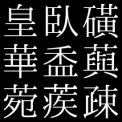
## Requirements
- python=3.11
### Packages
- lightning=2.5.0
- matplotlib=3.10.0
- numpy=2.2.3
- torch=2.6.0
- torchvision=0.21.0
- tqdm=4.67.1
## Pipeline
### Data Loading
The Kanji images were loaded into memory using Python Imaging Library (PIL) and torchvision transformations. The images were resized to 64 by 64 pixels to allow for more pooling in the convolutional networks. Pixel values were normalized according to the specific model requirements: scaled to [0, 1] for the VAE, and [-1, 1] for the GAN and DDPM. A random horizontal flip was used as data augmentation to effectively double the training dataset. Although Kanji characters are generally not horizontally symmetrical, the benefit of increased dataset size outweighed potential distortions. This preprocessing step enhanced the model's ability to generalize by providing varied training inputs.
### Models
#### Variational AutoEncoder
The Variational AutoEncoder (VAE) consists of two primary components: an encoder, which compresses input images into a compact n-dimensional latent representation, and a decoder, which reconstructs the original images from these compressed representations. The model is optimized by minimizing a combined loss function that consists of two terms: the binary cross-entropy loss between the original and reconstructed pixel values, and the Kullback-Leibler divergence of the learned latent space distribution from a predefined prior distribution. During image sampling from the decoder, a sigmoid activation function is applied to the outputs, matching the pixel-value constraints imposed by the binary cross-entropy loss.

The final VAE architecture utilized a ResNet-like design. Specifically, the encoder and decoder each comprised 7 residual blocks, with the encoder progressively increasing channel dimensions from 64 to 512 filters, and the decoder symmetrically decreasing them from 512 back down to 64. These residual blocks were combined with convolutional layers at the input and output stages to handle the specified image dimensions, as well as linear layers to transition between the three-dimensional image tensors and the lower-dimensional latent space.

See [resnet_vae.py](VAE/resnet_vae.py) for model creation code.
#### Generative Adversarial Network
The Generative Adversarial Network (GAN) consists of two neural networks: a discriminator, which distinguishes between real and generated (fake) images, and a generator, which creates new images to fool the discriminator. Although several loss functions can be used to train the discriminator, the hinge loss yielded the best performance in this project. The hinge loss encourages the discriminator to output predictions above 1 for real images and below -1 for generated images. Additionally, a gradient penalty was applied to stabilize training by penalizing the discriminator whenever the gradient norm deviates from 1, thereby enforcing smoothness and promoting stable convergence. The generator's loss function is based on the discriminator's predictions: it aims to maximize the discriminator's predicted scores on generated images, effectively pushing the predictions toward values associated with real images.

The final GAN architecture utilized was also ResNet-like. The discriminator and generator each had 4 residual blocks, with the discriminator progressing from 128 to 512 feature channels and the generator reversing this channel progression. The discriminator contained a fully-connected linear layer at the output, providing a single scalar prediction value. The generator included a linear layer to convert latent space vectors into three-dimensional image tensors of the required size.

See [resgan.py](GAN/resgan.py) for model creation code.
#### Denoising Diffusion Probabilistic Model
The Denoising Diffusion Probabilistic Model (DDPM) is a generative model that gradually transforms random noise into coherent, realistic images through an iterative denoising process. Training involves two main stages: a forward diffusion process, wherein Gaussian noise is progressively added to original images until the resulting distribution becomes approximately Gaussian, and a reverse denoising process, wherein a neural network learns to iteratively remove this added noise to reconstruct the original images. The model is optimized by training the network using a mean-squared error loss between predicted noise and the actual noise added at each diffusion step. 

The final DDPM architecture utilized a U-Net-like design, featuring encoder-decoder blocks with skip connections, enabling effective information sharing across layers and improved reconstruction quality. Specifically, the encoder path consisted of an initial convolutional layer followed by three residual downsampling blocks, progressively increasing the channel dimensions from 64 to 256 filters while reducing spatial resolution. The bottleneck included three additional residual blocks, increasing to 512 channels before decreasing back to 256 channels. The decoder path employed three residual upsampling blocks symmetrically mirroring the encoder, progressively decreasing channel counts and upsampling spatial dimensions using bilinear interpolation. Skip connections concatenated corresponding encoder layer outputs into each decoder block, enhancing gradient flow and preserving fine details. Additionally, sinusoidal positional embeddings were incorporated through linear layers at each block, informing the model of the current timestep during the denoising process.

See [unet.py](DDPM/unet.py) for model creation code.
## Usage
### Generating kanji
Fake Kanji images can be generated easily using the provided script, [generate_kanji.py](generate_kanji.py), which leverages the decoder from the VAE and the generator from the GAN. Follow these steps to generate Kanji images:
1. Open a terminal and navigate to the project's root directory.
2. Run the script with the command: `python ./generate_kanji.py`
3. This pop-up window will appear: 

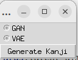 

   allowing you to select a model to use.

4. Click the **Generate Kanji** button and a 4x4 grid of kanji samples will appear in a pop-up window.

DDPM generation isn't included in the script yet due to its more complicated sampling algorithm.
### Training Models
The VAE and GAN training scripts are designed for ease of use, supporting various arguments for quick experimentation. Each script provides a -h argument to display available options and configurations. For example:

`python ./VAE/main.py -h`
`python ./GAN/main.py -h` 
#### Training the VAE or GAN
1. To train a VAE model, run:

`python ./VAE/main.py`

2. To train a GAN model, run:

`python ./GAN/main.py`  

The GAN training script supports three datasets—Kanji, MNIST, and CIFAR—for testing purposes. Arguments for dataset selection and hyperparameter tuning can be passed via the command line. Refer to the help menu (-h) for details.

#### Training the DDPM
The DDPM training script is less configurable via the command line, as it does not currently support hyperparameter tuning arguments. To train the DDPM, run:

`python ./DDPM/main.py`

To adjust hyperparameters (e.g., learning rate, diffusion steps), you will need to modify the code within the [main.py](DDPM/main.py) or [unet.py](DDPM/unet.py) manually.
## Samples
### VAE
| 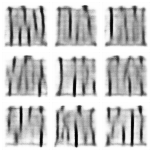 | 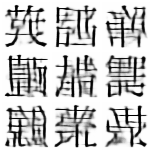 | 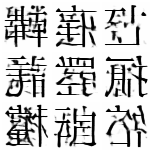 |
|:-----------------------------:|:-----------------------------:|:-----------------------------:|
| *VAE epoch 10*        | *VAE epoch 50*        | *VAE epoch 100*        |
### GAN
| 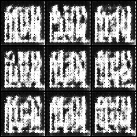 | 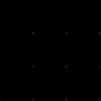 | 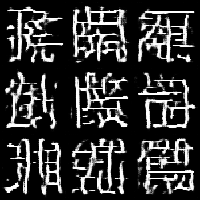 | 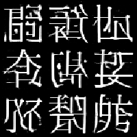 |
|:-----------------------------:|:-----------------------------:|:-----------------------------:|:-----------------------------:|
| *GAN epoch 10*        | *GAN epoch 50*        | *GAN epoch 100*        | *GAN epoch 100*        |
### DDPM
| 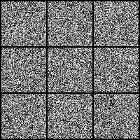 |  | 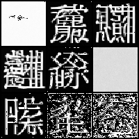 |  |
|:-----------------------------:|:-----------------------------:|:-----------------------------:|:-----------------------------:|
| *DDPM epoch 10*        | *DDPM epoch 50*        | *DDPM epoch 100*        | *DDPM epoch 100*        |
## Credits
GAN related repositories:
[pytorch-spectral-normalization-gan](https://github.com/christiancosgrove/pytorch-spectral-normalization-gan)
[PyTorch-GAN](https://github.com/eriklindernoren/PyTorch-GAN)
Diffusion related repositories:
[Diffusion-Models-pytorch](https://github.com/dome272/Diffusion-Models-pytorch/tree/main)
[denoising-diffusion-pytorch](https://github.com/rosinality/denoising-diffusion-pytorch/tree/master)
Triplet Attention:
[triplet-attention](https://github.com/landskape-ai/triplet-attention/tree/f07524e45db5eea1357c50316f30ab99a292d2f9)
## Further Reading
